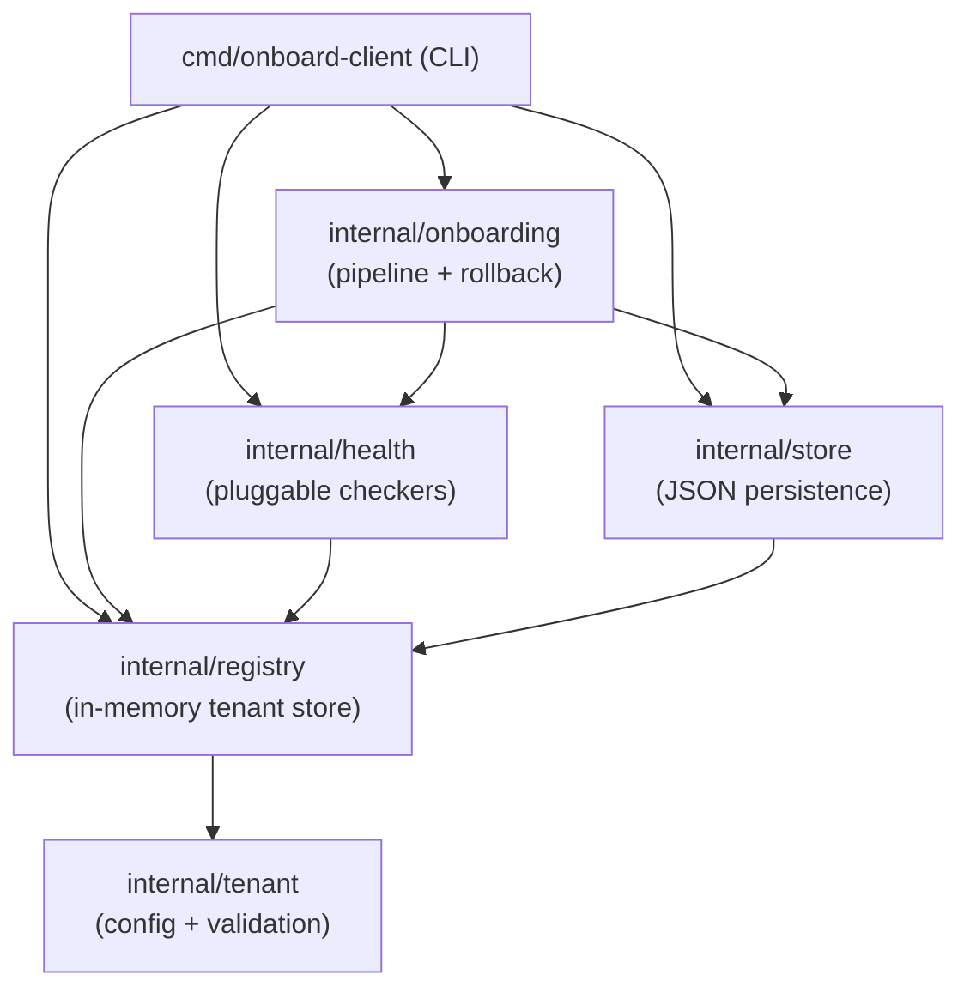
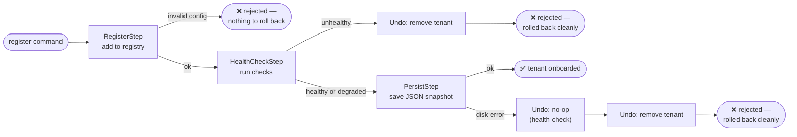

# admitctl

[](https://github.com/hassanli775/admitctl/actions/workflows/ci.yml)

A multi-tenant onboarding platform: register a tenant with its own config,
run automated health checks against it, and persist the result — all as a
single rollback-safe operation. If anything about a tenant's configuration
is unsound, onboarding fails cleanly and leaves **zero trace** behind, the
same way a real production deployment pipeline should.

Built as a simulator for the problem every platform team eventually hits:
onboarding N clients, each with different auth, rate limits, and schema
versions, without one bad onboarding attempt corrupting the system or
leaving orphaned state behind.

## What it does

- **Registers tenants** against a validated config schema (auth method,
  rate limits, data schema version, feature flags)
- **Runs automated health checks** on every new tenant before it's
  considered onboarded — a fundamentally broken config (e.g. an
  unsupported schema version) is rejected outright; a merely suboptimal
  one (e.g. no burst headroom) is allowed through with a warning
- **Rolls back automatically** if onboarding fails partway through —
  compensating actions undo every completed step in reverse order, so a
  rejected tenant leaves no trace in the registry or on disk
- **Persists to a local JSON store** with atomic (temp-file-then-rename)
  writes, so tenant state survives across CLI invocations
- **Reports ongoing health** for any tenant or all active tenants, on
  demand — useful for periodic checks, not just at onboarding time

## Architecture



Each package has one job and depends only on the ones below it in this
diagram — `tenant` knows nothing about `registry`, `registry` knows nothing
about persistence, and so on. That's what makes each piece independently
testable (see [Testing](#testing)) and makes the in-memory registry
swappable for a real database later without touching anything above it.

### The onboarding pipeline

Registering a tenant isn't a single step — it's three, and a failure at
any point rolls back everything already done:



Only an **Unhealthy** result blocks onboarding — a **Degraded** one (e.g. a
tenant with no burst headroom) is allowed through with a warning, since it's
a risk to flag, not a defect to reject. See
[`internal/onboarding/pipeline_test.go`](internal/onboarding/pipeline_test.go)
for the rollback-ordering guarantees this is built on.

## Installation

```bash
git clone https://github.com/hassanli775/admitctl.git
cd admitctl
go build -o onboard-client ./cmd/onboard-client
```

Requires Go 1.22+. No third-party dependencies — the CLI is built entirely
on the standard library (`flag`, `text/tabwriter`, `encoding/json`), which
keeps the build simple and dependency-free.

## Usage

```bash
# Register a tenant
./onboard-client register --id acme-corp --name "Acme Corp" \
  --auth api_key --rps 100 --burst 250 \
  --schema-version v1 --flags beta_dashboard,new_ui

# List every registered tenant
./onboard-client list

# Inspect one tenant
./onboard-client get acme-corp

# Run health checks (one tenant, or all active tenants)
./onboard-client health acme-corp
./onboard-client health
./onboard-client health --include-inactive

# Deactivate a tenant (soft — keeps its record)
./onboard-client deactivate acme-corp
```

Tenant state is stored at `~/.admitctl/tenants.json` by default; override
with the `ADMITCTL_STORE` environment variable.

Run [`examples/demo.sh`](examples/demo.sh) for a full walkthrough of every
command, including a real rollback:

```bash
go build -o /tmp/onboard-client ./cmd/onboard-client
ADMITCTL_BIN=/tmp/onboard-client ./examples/demo.sh
```

Example persisted tenant records (a healthy one, a degraded one for each
kind of warning) are in [`examples/tenants/`](examples/tenants/) —
generated by actually running the CLI, not hand-written.

## Design decisions worth knowing about

- **In-memory registry, pluggable persistence.** `internal/registry` has
  no idea `internal/store` exists. The CLI hydrates a `Registry` from a
  JSON snapshot at startup and saves after mutations — swapping in a real
  database later means writing a new adapter, not touching the registry.
- **Deactivate vs. Remove.** Deactivating a tenant is a normal, auditable
  lifecycle transition — the record stays, just marked inactive. `Remove`
  is a hard delete that exists *only* to support rollback: undoing a
  registration that should never have succeeded. Application code doing
  ordinary offboarding should never call `Remove`.
- **Atomic writes.** `store.Save` writes to a temp file and renames it
  into place, so a crash mid-write can't leave a truncated or corrupt
  store file behind.
- **Rollback via compensating actions, not a database transaction.**
  Since state here spans an in-memory map *and* a file on disk, there's no
  single transaction to wrap it in — instead every step defines its own
  `Undo`, and the pipeline runs them in reverse order on any failure. This
  is the same pattern (a saga) real distributed deployment systems use
  when a single atomic transaction isn't available.

## Project structure

```
cmd/onboard-client/     CLI entrypoint — register, list, get, deactivate, health
internal/tenant/        Config schema + validation
internal/registry/      Concurrency-safe in-memory tenant store
internal/store/         JSON snapshot persistence (atomic writes)
internal/health/        Pluggable health checkers + report aggregation
internal/onboarding/    Rollback-safe onboarding pipeline
examples/               Demo script + example tenant records
```

## Testing

```bash
go vet ./...
go test ./... -race
```

Every package is tested in isolation — the onboarding pipeline's rollback
logic is tested with fake steps that log call order, independent of any
real step's business logic, and the concrete steps are tested independently
of the pipeline itself. The full suite runs under Go's race detector.
